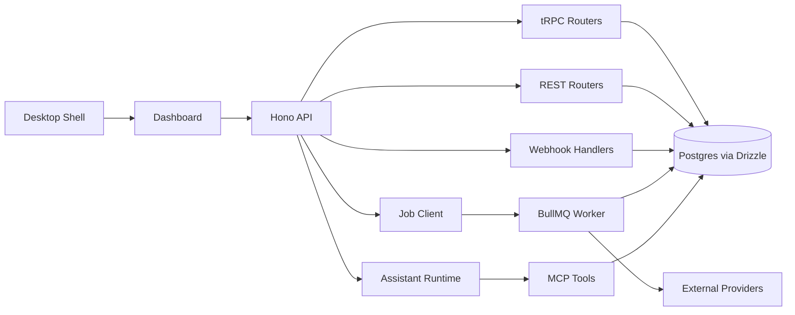
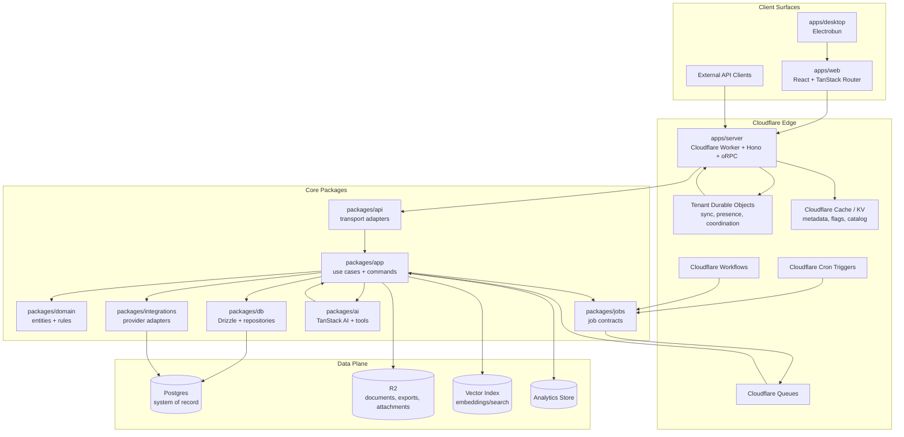

# Dawn PRD: Business Operating System

Status: Draft
Owner: Product/Engineering
Reference product: Midday, cloned read-only in `ref/midday`
Target posture: End-state architecture, not MVP
Last updated: 2026-06-14

## 1. Executive Summary

Dawn is a modern business operating system for owner-operators, freelancers, agencies, and small teams. It combines banking, transactions, documents, inbox, invoicing, time/work tracking, reporting, and an AI assistant into one coherent workspace.

The product should learn from Midday's broad surface area while avoiding the architectural sprawl that comes from mixing UI logic, API handlers, background jobs, provider code, and domain rules without a strict application boundary. Dawn should keep the current repo's clean TypeScript stack, then add durable application modules, Cloudflare-native deployment, event-driven workflows, local-first-feeling data sync through TanStack DB, and AI capabilities through TanStack AI.

The desired end-state is not a clone. It is a sharper system:

- One canonical domain and application layer shared by web, server, workers, desktop, API, assistant, and automations.
- Cloudflare-first runtime for request handling, realtime coordination, caching, durable workflows, and low-latency global access.
- Postgres as the system of record for financial data, invoices, documents, permissions, audit trails, and durable state.
- Durable Objects for per-tenant coordination, realtime sync, presence, idempotency gates, and lightweight tenant-local orchestration.
- Queues, Workflows, Cron Triggers, and optionally Trigger.dev for long-running or third-party-heavy tasks.
- TanStack Router for route structure, TanStack Query for server interactions, TanStack DB for reactive synced client collections, and TanStack AI for assistant UX and typed AI flows.
- Provider adapters isolated behind ports, so banking, accounting, document AI, messaging, payments, and storage can be swapped without rewriting domain logic.
- An event/outbox backbone so every state change can reliably trigger downstream side effects, analytics, audit records, notifications, sync invalidation, and assistant context updates.

## 2. Product Vision

Dawn should be the command center for a business's operational truth.

The core promise:

> Every important business artifact, transaction, task, customer, invoice, document, and insight lives in one trustworthy system that can explain itself, automate repeat work, and keep humans in control.

The product should be optimized for:

- Fast daily review of business health.
- Accurate transaction categorization and reconciliation.
- Document capture and extraction.
- Invoice creation, sending, payment tracking, and recurring billing.
- Customer and vendor understanding.
- Work/time tracking connected to billing.
- Weekly and monthly operating insight.
- Secure multi-tenant collaboration.
- AI assistance grounded in the user's real business data.

## 3. Product Principles

### 3.1 Correctness Before Convenience

Financial and operational records must be durable, auditable, and explainable. AI can recommend, draft, summarize, match, and classify, but it must not silently mutate authoritative financial state without a traceable command and permission check.

### 3.2 One Domain, Many Surfaces

The same use cases must power:

- Web app
- Desktop app
- Public API
- Internal API
- Background workers
- Webhooks
- AI tools
- Automations

No surface should reimplement business rules.

### 3.3 Event-Driven, Not Callback-Driven

Important state changes should emit domain events through a durable outbox. Side effects must be retried, observable, idempotent, and independently deployable.

### 3.4 Cloudflare Native Where It Helps

Use Cloudflare for latency-sensitive, globally distributed, and coordination-heavy workloads. Do not force all business logic into Workers if it makes database access, package support, observability, or job execution worse. The target architecture should support both Cloudflare Workers and a regional Node/Bun worker pool where appropriate.

### 3.5 AI Is a Product Surface and an Infrastructure Concern

AI should appear as:

- Assistant chat
- Inline actions
- Classification
- Extraction
- Search
- Recommendations
- Explanation
- Anomaly detection
- Drafting

AI should also be constrained by:

- Tool permissions
- Tenant scoping
- Audit logs
- Deterministic fallbacks
- Confidence thresholds
- User approval for risky actions
- Evaluation datasets for repeatable quality checks

### 3.6 Local-First Feeling Without Local-First Risk

The app should feel instant and collaborative, but authoritative business state remains server-owned. TanStack DB should provide reactive local collections, optimistic interactions, and sync ergonomics while preserving server-side authorization, validation, and auditability.

## 4. Target Users

### 4.1 Primary Users

- Solo founders and freelancers who need cashflow, invoices, documents, and taxes under control.
- Small agencies that need clients, invoices, expenses, time tracking, and team visibility.
- Consultants and contractors managing multiple customers and recurring work.
- Small businesses that want business intelligence without adopting an enterprise ERP.

### 4.2 Secondary Users

- Bookkeepers and accountants invited into client workspaces.
- Operations assistants who process inbox items and documents.
- Team members who track time, upload receipts, and collaborate on client work.
- Developers or integrators who use the public API.

### 4.3 System Actors

- Web app user
- Desktop app user
- Public API client
- OAuth app
- Banking provider webhook
- Accounting provider webhook
- Payment provider webhook
- Email/inbox provider webhook
- Document processing worker
- Transaction sync worker
- AI assistant runtime
- Durable Object tenant coordinator
- Scheduled workflow

## 5. Current Repository Baseline

The current repo is a clean Better-T-Stack application with:

- `apps/web`: React, Vite, TanStack Router, TanStack Query, shadcn-style UI primitives.
- `apps/server`: Hono server with oRPC and OpenAPI endpoint support.
- `apps/desktop`: Electrobun desktop shell.
- `packages/api`: oRPC router and procedure setup.
- `packages/auth`: Better Auth with Drizzle adapter and Polar plugin.
- `packages/db`: Drizzle and Postgres schema.
- `packages/env`: environment validation.
- `packages/infra`: Cloudflare deployment scaffold through Alchemy.
- `packages/ui`: shared UI components and global styles.

This is a good foundation. The main missing pieces are:

- Domain layer.
- Application use-case layer.
- Tenant/team model.
- Authorization model beyond authenticated user.
- Financial schema.
- Outbox/event architecture.
- Worker architecture.
- Integration provider interfaces.
- Sync model.
- AI model, tool registry, and evaluation harness.
- Cloudflare runtime design beyond web deploy.

## 6. Midday Reference Architecture Summary

Midday is a broad monorepo product with many useful reference surfaces.

### 6.1 Midday Applications

- API app: Hono, tRPC, REST, webhooks, OpenAPI.
- Dashboard app: Next.js app with authenticated layouts and server-prefetched data.
- Worker app: BullMQ workers with processors and schedulers.
- Desktop app: Tauri wrapper around hosted dashboard.
- Website app: public marketing/product site.

### 6.2 Midday Packages

Midday separates many provider and domain-ish concerns into packages:

- Database schema and queries.
- Banking providers.
- Accounting providers.
- Document extraction.
- Invoice rendering.
- Insights.
- App store and integrations.
- Supabase utilities.
- Job client.
- Notifications.
- Events.
- MCP/assistant tools.

### 6.3 Midday Data Flow

The common Midday flow is:



### 6.4 Midday Strengths To Preserve

- Broad product scope validated by real business workflows.
- Clear split between dashboard, API, worker, and shared packages.
- Provider facades for banking and accounting.
- Good use of background processing for bank sync, documents, invoices, notifications, and insights.
- Strong webhook awareness.
- Multiple API surfaces: internal RPC, REST, webhooks, MCP.
- Documented database pooling and replica strategy.
- Assistant/MCP tools grounded in product actions.

### 6.5 Midday Weaknesses To Improve

- Business logic is heavily concentrated in database query packages and API routers instead of a clean use-case layer.
- Background work is split between BullMQ and Trigger.dev, increasing operational complexity.
- The public REST API, internal tRPC API, webhooks, and assistant tools can drift because they are not forced through one application boundary.
- Database schema is broad and centralized, which makes ownership and migration risk harder to reason about.
- TypeScript build errors are ignored in dashboard config, which is not acceptable for this repo's target quality.
- AI and tools are powerful but should be more explicitly permissioned, evaluated, and audited.

## 7. Desired End-State Architecture

### 7.1 High-Level Architecture



### 7.2 Package Ownership

#### `apps/web`

Responsibilities:

- Product UI.
- Route composition.
- User interaction state.
- TanStack Router route definitions.
- TanStack Query for command/mutation lifecycle.
- TanStack DB collections for synced operational data.
- TanStack AI assistant UI and client-side AI interaction state.

Must not own:

- Business rules.
- Provider-specific logic.
- Permission decisions.
- Financial calculations beyond display formatting.

#### `apps/server`

Responsibilities:

- Hono runtime.
- oRPC handler.
- REST/public API handler.
- Webhook ingress.
- Auth/session extraction.
- Request context assembly.
- Cloudflare Worker bindings.
- OpenAPI/reference exposure.
- Durable Object routing.

Must not own:

- Domain rules.
- Provider workflows.
- Job implementations.
- AI tool behavior beyond transport.

#### `apps/worker`

New application. Responsibilities:

- Queue consumers.
- Scheduled job execution.
- Long-running workflow execution.
- Retry handling.
- Dead-letter handling.
- Provider sync orchestration.
- Document processing.
- Invoice send/reminder jobs.
- Insight generation.

Implementation options:

- Cloudflare Queue consumers where runtime limits fit.
- Cloudflare Workflows for durable multi-step flows.
- Trigger.dev for complex long-running provider workflows if Cloudflare Workflows are not enough.
- Regional Bun/Node worker for jobs requiring packages or runtimes incompatible with Cloudflare Workers.

#### `apps/desktop`

Responsibilities:

- Native shell.
- App deep links.
- Notifications.
- File drop/share integration.
- Global quick capture.
- Optional command palette window.

The desktop app should remain a shell around the same web product rather than a separate product.

#### `packages/domain`

New package. Responsibilities:

- Pure business concepts.
- Entity invariants.
- Value objects.
- Domain events.
- Permission-independent state transitions.
- Financial math primitives.
- Deterministic matching rules.
- Time and currency rules.

Examples:

- Money
- DateRange
- Transaction
- BankAccount
- Document
- InboxItem
- Customer
- Invoice
- InvoiceLine
- RecurringSchedule
- Project
- TimeEntry
- Category
- Tag
- TeamRole

No network, database, auth provider, or UI imports.

#### `packages/app`

New package. Responsibilities:

- Use cases.
- Command handlers.
- Query services.
- Transaction boundaries.
- Authorization checks.
- Idempotency checks.
- Outbox event writes.
- Calls to provider ports.
- AI tool command execution.

All external surfaces should call this package.

Example use cases:

- `createTeam`
- `inviteTeamMember`
- `connectBankAccount`
- `syncBankConnection`
- `categorizeTransaction`
- `matchInboxItemToTransaction`
- `createInvoice`
- `sendInvoice`
- `recordInvoicePayment`
- `uploadDocument`
- `extractDocument`
- `askAssistant`
- `runWeeklyInsights`

#### `packages/api`

Current package should evolve into transport contracts:

- oRPC routers.
- REST route definitions.
- Request/response schemas.
- OpenAPI metadata.
- Error mapping.
- API versioning.

It should call `packages/app`, not `packages/db` directly.

#### `packages/db`

Responsibilities:

- Drizzle schema.
- Migrations.
- Repository primitives.
- Database transaction helper.
- Row-level mapping.
- Outbox persistence.
- Inbox locks and idempotency state.

It should not own business decisions. Query methods can exist, but business naming belongs in `packages/app`.

#### `packages/integrations`

New package. Responsibilities:

- Provider interfaces.
- Provider-specific clients.
- Webhook verification helpers.
- External payload normalization.
- Provider capability declarations.

Suggested subpackages or folders:

- Banking: Plaid, Teller, GoCardless, Enable Banking.
- Accounting: QuickBooks, Xero, Fortnox.
- Payments: Stripe, Polar, bank transfer reconciliation.
- Email/inbox: Postmark, Gmail, Microsoft Graph.
- Messaging: Slack, Teams, Telegram, WhatsApp.
- Storage/OCR/AI providers.

#### `packages/jobs`

New package. Responsibilities:

- Job names.
- Job payload schemas.
- Queue names.
- Retry policy declarations.
- Idempotency key helpers.
- Worker registration helpers.

No business implementation. Jobs call `packages/app`.

#### `packages/ai`

New package. Responsibilities:

- TanStack AI integration.
- Assistant runtime contracts.
- Tool registry.
- Tool permission mapping.
- Prompt templates.
- Retrieval configuration.
- Evaluation datasets.
- Safety policies.
- Structured output schemas.

AI tools should call `packages/app` use cases.

#### `packages/sync`

New package. Responsibilities:

- TanStack DB collection definitions.
- Sync protocol contracts.
- Collection authorization scopes.
- Change feed mapping.
- Conflict strategy declarations.
- Client/server collection schema sharing.

This package should define what data is syncable and how it becomes visible in the client.

## 8. Runtime Architecture

### 8.1 Cloudflare Worker API

The API should run as a Cloudflare Worker when possible.

Responsibilities:

- Low-latency request handling.
- Auth/session extraction.
- oRPC endpoint.
- REST endpoint.
- Webhook endpoint.
- Assistant streaming endpoint.
- Sync endpoint for TanStack DB.
- Durable Object routing.
- Queue enqueueing.
- Cron trigger entry points.

Requirements:

- All routes create a typed request context.
- All tenant-scoped requests require a resolved team/workspace.
- All mutations pass through `packages/app`.
- All webhook handlers verify signatures before reading mutable state.
- All errors map to typed public errors.
- All requests include a request id.
- All mutating requests include idempotency support where practical.

### 8.2 Durable Objects

Use Durable Objects for per-tenant coordination, not as the primary database.

Recommended Durable Objects:

#### TenantCoordinatorDO

Responsibilities:

- Per-team realtime fanout.
- Connected client presence.
- Collection invalidation notices.
- Serialized coordination for rare operations that should not run concurrently per team.
- Lightweight idempotency cache for very recent duplicate requests.

Examples:

- Notify all connected clients that transaction collection changed.
- Prevent two manual syncs for the same bank account from starting simultaneously.
- Coordinate assistant streaming sessions for a team.

#### SyncSessionDO

Responsibilities:

- Track active sync subscriptions.
- Manage backpressure.
- Fan out collection-level changes.
- Keep per-client cursor metadata.

This may be combined with TenantCoordinatorDO if complexity remains low.

#### ImportSessionDO

Responsibilities:

- Coordinate large CSV/import workflows.
- Track client-visible progress.
- Stream validation errors back to client.

### 8.3 Cloudflare Queues

Use Queues for asynchronous jobs that are:

- Short to medium duration.
- Retryable.
- Side-effect oriented.
- Not dependent on unsupported Node APIs.

Queue categories:

- `banking-sync`
- `document-processing`
- `inbox-processing`
- `invoice-delivery`
- `notifications`
- `insights`
- `integrations`
- `ai-background`
- `exports`

### 8.4 Cloudflare Workflows

Use Workflows for durable multi-step processes that need persisted progress and resumability.

Candidates:

- Bank connection initial import.
- Multi-account transaction sync.
- Invoice delivery and reminder lifecycle.
- Document extraction pipeline.
- Accounting export/sync.
- Customer statement generation.
- Bulk import with validation, preview, commit, and rollback windows.

### 8.5 Trigger.dev

Trigger.dev is acceptable when it materially reduces complexity for:

- Long-running provider workflows.
- Jobs requiring rich Node ecosystem support.
- Human-observable workflow debugging.
- Complex retry policies.
- Scheduled jobs that exceed Cloudflare runtime limits.
- AI workflows that require multi-step execution and human approval.

Trigger.dev should be treated as an execution adapter behind `packages/jobs`, not as a place where domain logic lives.

### 8.6 Regional Worker Pool

If some workloads do not fit Cloudflare Workers or Trigger.dev, add a regional Bun/Node worker process.

Candidates:

- Heavy PDF rendering.
- Large CSV parsing.
- Provider SDKs that require Node APIs.
- Long OCR/document processing.
- Accounting exports that require large memory.

The worker pool should consume the same job contracts from `packages/jobs`.

## 9. Data Architecture

### 9.1 System Of Record

Postgres is the source of truth.

Use Drizzle for:

- Schema.
- Migrations.
- Type-safe queries.
- Transaction management.
- Repository implementation.

Do not use Durable Objects, KV, browser storage, or vector indexes as authoritative financial storage.

### 9.2 Data Domains

Core tables should be grouped by domain:

#### Identity And Tenancy

- users
- sessions
- accounts
- teams
- team_memberships
- team_invites
- roles
- permission_overrides
- api_keys
- oauth_applications
- oauth_grants

#### Banking And Ledger

- bank_connections
- bank_accounts
- transactions
- transaction_lines if split transactions are supported
- transaction_categories
- transaction_tags
- transaction_attachments
- counterparties
- balances
- exchange_rates
- reconciliation_runs
- transaction_imports

#### Documents And Inbox

- documents
- document_versions
- document_objects
- document_extractions
- inbox_items
- inbox_sources
- inbox_matches
- match_feedback
- aliases
- hard_negative_matches

#### Sales And Billing

- customers
- customer_contacts
- products
- invoices
- invoice_lines
- invoice_templates
- recurring_invoices
- invoice_payments
- invoice_events
- payment_links
- credit_notes

#### Work Management

- projects
- project_members
- time_entries
- tasks
- task_events
- billable_rates

#### Integrations

- integration_connections
- integration_accounts
- integration_tokens
- provider_webhook_events
- provider_sync_runs
- provider_objects

#### AI And Search

- assistant_threads
- assistant_messages
- assistant_tool_calls
- assistant_feedback
- embeddings
- search_documents
- ai_evaluations

#### Operations

- outbox_events
- job_runs
- idempotency_keys
- audit_log
- notifications
- feature_flags
- billing_subscriptions
- usage_meter_events

### 9.3 Money Representation

Money must never use JavaScript floating point as an authoritative representation.

Recommended model:

- Store `amount_minor` as integer when currency has stable minor units.
- Store `amount_decimal` as exact decimal string for currencies or assets where minor-unit assumptions are unsafe.
- Always store `currency`.
- Store `exchange_rate` as exact decimal string.
- Store `base_currency_amount` where reporting requires a normalized currency.

Domain APIs should expose a `Money` value object.

### 9.4 IDs

Use stable, non-enumerable IDs.

Requirements:

- Public IDs must not leak row count.
- Provider object IDs must be stored separately from internal IDs.
- Idempotency keys must be unique per team and operation.
- External API resources should use stable IDs that can survive internal migrations.

### 9.5 Audit Log

Every sensitive change must write an audit log entry.

Audit log should capture:

- Actor type: user, api_key, oauth_app, system, assistant, provider_webhook.
- Actor ID.
- Team ID.
- Action.
- Resource type.
- Resource ID.
- Before/after summary where safe.
- Request ID.
- IP and user agent where applicable.
- Tool call ID for AI-originated actions.

### 9.6 Outbox Events

Every important state transition writes an outbox event in the same DB transaction.

Examples:

- `transaction.created`
- `transaction.updated`
- `transaction.categorized`
- `document.uploaded`
- `document.extracted`
- `inbox_item.received`
- `inbox_item.matched`
- `invoice.created`
- `invoice.sent`
- `invoice.paid`
- `bank_account.sync_requested`
- `bank_account.sync_completed`
- `assistant.tool_call_completed`

Outbox consumers publish to:

- Cloudflare Queue.
- Durable Object invalidation.
- Analytics.
- Notification system.
- Search/vector indexing.
- Webhook delivery for external developers.

## 10. Sync And Client Data Model

### 10.1 TanStack DB Role

TanStack DB should be used for reactive client collections that make the app feel instant.

Use TanStack DB for:

- Transaction list and detail.
- Inbox list and detail.
- Documents metadata.
- Customers.
- Invoices.
- Projects.
- Time entries.
- Tags and categories.
- Notifications.
- Assistant thread metadata.

Do not use TanStack DB as a replacement for server-side authorization or validation.

### 10.2 Sync Modes

Supported sync modes:

- Initial collection load.
- Incremental update by cursor.
- Server-pushed invalidation.
- Optimistic local mutation with server confirmation.
- Conflict resolution for editable records.
- Read-only projection sync for derived records.

### 10.3 Sync Protocol

Each collection should define:

- Collection name.
- Server query.
- Required permission.
- Tenant scope.
- Cursor field.
- Sort key.
- Mutation capabilities.
- Conflict policy.
- Redaction policy.

Example collections:

- `transactions`
- `transaction_categories`
- `bank_accounts`
- `inbox_items`
- `documents`
- `customers`
- `invoices`
- `projects`
- `time_entries`
- `notifications`

### 10.4 Optimistic Mutations

Optimistic updates are allowed for:

- Tagging.
- Categorization.
- Marking inbox item done.
- Editing customer metadata.
- Draft invoice edits.
- Time entry edits.

Optimistic updates are not allowed without confirmation for:

- Sending invoices.
- Recording payments.
- Deleting financial records.
- Connecting bank providers.
- Changing team roles.
- Exporting to accounting providers.

### 10.5 Realtime Strategy

Realtime should be event-driven:

1. Use case commits DB transaction and outbox event.
2. Outbox dispatcher sends collection invalidation to TenantCoordinatorDO.
3. TenantCoordinatorDO fans out to connected clients.
4. Client refreshes affected TanStack DB collection range by cursor.

This avoids treating realtime delivery as authoritative.

## 11. AI Architecture

### 11.1 TanStack AI Role

TanStack AI should power assistant state, streaming interaction, typed tool execution UX, and AI-enabled app flows.

Use TanStack AI for:

- Assistant chat.
- Inline explain buttons.
- Natural language filters.
- Drafting invoice emails.
- Categorization suggestions.
- Inbox match explanation.
- Document extraction review.
- Weekly insights generation flow.
- Tool call visualization.

### 11.2 AI Runtime

The runtime should include:

- Model provider adapter.
- Prompt registry.
- Tool registry.
- Retrieval adapter.
- Permission-aware tool resolver.
- Structured output validation.
- Conversation persistence.
- Evaluation harness.

### 11.3 AI Tools

Tools should be thin wrappers around application use cases.

Example tools:

- `search_transactions`
- `get_transaction`
- `categorize_transaction`
- `explain_cashflow`
- `search_documents`
- `extract_document_summary`
- `create_invoice_draft`
- `send_invoice_for_approval`
- `list_open_invoices`
- `create_customer`
- `start_bank_sync`
- `get_weekly_insights`
- `create_time_entry`

Each tool requires:

- Name.
- Description.
- Input schema.
- Output schema.
- Required permission.
- Risk level.
- Whether user approval is required.
- Audit behavior.
- Rate limit policy.

### 11.4 AI Risk Levels

#### Read

Reads scoped data and explains it.

Examples:

- Search documents.
- Summarize cashflow.
- Explain invoice status.

Approval required: no.

#### Suggest

Produces recommendations but does not mutate state.

Examples:

- Suggest category.
- Suggest invoice email.
- Suggest duplicate match.

Approval required: no, but UI must show confidence.

#### Draft

Creates editable draft records.

Examples:

- Draft invoice.
- Draft customer note.
- Draft recurring invoice schedule.

Approval required: yes for promotion to active/sent states.

#### Mutate

Changes existing business state.

Examples:

- Categorize transaction.
- Mark inbox item resolved.
- Update customer details.

Approval required: depends on user setting and risk.

#### External Side Effect

Sends something or changes external state.

Examples:

- Send invoice.
- Sync to accounting provider.
- Send Slack notification.
- Email customer.

Approval required: yes, unless explicitly automated by a configured rule.

### 11.5 Retrieval And Grounding

AI responses should ground in:

- Transactions.
- Documents.
- Invoices.
- Customers.
- Projects.
- Time entries.
- Team settings.
- Accounting categories.
- Prior assistant threads.

Retrieval must enforce:

- Team scope.
- User permissions.
- Resource visibility.
- Redaction rules.
- Auditability.

### 11.6 Evaluation

Create evaluation datasets for:

- Transaction categorization.
- Inbox-to-transaction matching.
- Receipt extraction.
- Invoice drafting.
- Cashflow explanation.
- Tool selection.
- Refusal behavior.
- Permission enforcement.

Metrics:

- Accuracy.
- False positive rate.
- False mutation rate.
- Hallucinated source rate.
- Tool-call success rate.
- User correction rate.
- Latency.
- Cost per successful task.

## 12. Domain Requirements

### 12.1 Identity, Teams, And Permissions

Requirements:

- Users can create and belong to multiple teams.
- Teams own business data.
- Users have roles per team.
- Roles grant permissions by resource and action.
- API keys are scoped to teams and permissions.
- OAuth apps can request scoped permissions.
- Assistant tools resolve permissions exactly like user/API requests.
- Sensitive actions require recent auth or MFA once MFA exists.

Default roles:

- Owner
- Admin
- Member
- Accountant
- Viewer

Permission examples:

- `transactions.read`
- `transactions.write`
- `transactions.categorize`
- `documents.read`
- `documents.write`
- `invoices.read`
- `invoices.write`
- `invoices.send`
- `bank_connections.manage`
- `team.manage`
- `settings.billing`
- `api_keys.manage`
- `assistant.use`
- `assistant.mutate`

### 12.2 Banking

Requirements:

- Users can connect bank providers.
- Users can connect multiple bank accounts per team.
- System imports transactions and balances.
- Syncs are idempotent.
- Provider transactions normalize into canonical transaction records.
- Duplicate detection prevents repeated transactions.
- Manual CSV import uses the same canonical normalization flow.
- Users can exclude accounts from reporting.
- Users can disconnect providers without deleting historical records by default.

Provider abstraction:

- `createConnection`
- `refreshConnection`
- `listAccounts`
- `syncAccount`
- `normalizeTransaction`
- `verifyWebhook`
- `handleWebhook`

### 12.3 Transactions And Ledger

Requirements:

- Transactions support income, expense, transfer, fee, refund, and adjustment classification.
- Users can categorize transactions.
- Users can tag transactions.
- Users can attach documents to transactions.
- Transactions can be split into lines if needed.
- Transfers should be matchable across accounts.
- System tracks reviewed/unreviewed state.
- System tracks source: bank sync, CSV import, manual, provider webhook.
- Transaction edits are auditable.

Derived reporting:

- Revenue.
- Expenses.
- Profit.
- Burn.
- Runway.
- Category breakdown.
- Customer/vendor breakdown.
- Cash balance.
- Tax-relevant summaries.

### 12.4 Inbox And Documents

Requirements:

- Users can forward emails or upload files.
- Inbox items can contain files, text, metadata, and source information.
- Documents are stored in R2.
- Metadata is stored in Postgres.
- Extraction results are versioned.
- Users can review and correct extraction.
- Inbox items can be matched to transactions.
- System learns from user match feedback.
- Duplicate documents are detected by hash and metadata.

Document types:

- Receipt.
- Invoice received.
- Invoice sent.
- Bank statement.
- Contract.
- Tax document.
- Other.

Extraction fields:

- Merchant/vendor.
- Customer.
- Date.
- Due date.
- Currency.
- Amount.
- Tax amount.
- Invoice number.
- Payment reference.
- Line items where available.
- Confidence score.

### 12.5 Matching

Requirements:

- Match inbox items to transactions using deterministic and AI-assisted signals.
- Store match score and explanation.
- Store accepted/rejected feedback.
- Learn aliases per team.
- Store hard negatives to prevent repeated bad suggestions.
- Never auto-attach low-confidence matches.

Signals:

- Amount.
- Currency.
- Date proximity.
- Counterparty name.
- Payment reference.
- Invoice number.
- Email sender.
- Document text.
- Prior team feedback.
- Provider metadata.

### 12.6 Invoicing

Requirements:

- Users can create customers.
- Users can create products/services.
- Users can create invoice drafts.
- Users can preview invoices.
- Users can send invoices by email.
- Invoices can be exported to PDF.
- Users can record payments manually.
- Payment provider events can mark invoices paid.
- Recurring invoices can generate future invoices.
- Reminders can be configured.
- Invoice lifecycle is explicit and audited.

Invoice states:

- Draft
- Scheduled
- Sent
- Viewed
- Partially paid
- Paid
- Overdue
- Void

### 12.7 Customers

Requirements:

- Customers belong to teams.
- Customers can have multiple contacts.
- Customers can have billing details.
- Customers can be linked to invoices, documents, projects, and transactions.
- AI can summarize customer history and payment behavior.

### 12.8 Projects And Time Tracking

Requirements:

- Users can create projects.
- Projects can link to customers.
- Users can track time entries.
- Time entries can be billable or non-billable.
- Billable time can be turned into invoice lines.
- Team members can be assigned to projects.
- Reports can show utilization and billable value.

### 12.9 Reporting And Insights

Requirements:

- Dashboard shows business health at a glance.
- Reports support date ranges, accounts, categories, customers, and tags.
- Insights explain changes, anomalies, and risks.
- Weekly insight generation is scheduled.
- Users can drill from insight to source records.

Core reports:

- Profit and loss.
- Cashflow.
- Revenue by customer.
- Expense by category.
- Unpaid invoices.
- Tax summary.
- Time and utilization.
- Document/inbox backlog.

### 12.10 Integrations

Requirements:

- Integrations are modeled as installable connections.
- Each integration declares capabilities.
- Integration tokens are encrypted.
- Webhooks are verified.
- Sync state is visible.
- Sync failures are actionable.
- Integrations can be disabled without data loss.

Categories:

- Banking.
- Accounting.
- Payments.
- Email.
- Messaging.
- Storage.
- AI providers.
- Calendar/time.

### 12.11 Public API

Requirements:

- External developers can access team-scoped resources through API keys or OAuth.
- API is versioned.
- OpenAPI is generated.
- Scopes map to product permissions.
- Rate limits are enforced.
- Idempotency keys are supported for mutations.
- Webhook subscriptions allow external systems to receive events.

### 12.12 Automations

Requirements:

- Users can configure rule-based automations.
- Automations can be triggered by domain events.
- Automations can call approved actions.
- Risky actions require approval unless explicitly permitted.
- Automation runs are logged and replayable.

Examples:

- Auto-categorize recurring software expenses.
- Notify Slack when invoice is overdue.
- Attach receipts from trusted email senders.
- Create draft invoice from approved billable time.
- Export paid invoices to accounting provider.

## 13. User Experience Requirements

### 13.1 Information Architecture

Primary navigation:

- Overview
- Transactions
- Inbox
- Documents
- Invoices
- Customers
- Projects
- Reports
- Assistant
- Automations
- Integrations
- Settings

### 13.2 Overview

The overview should be an operating dashboard, not a marketing page.

It should show:

- Cash balance.
- Revenue.
- Expenses.
- Profit.
- Open invoices.
- Inbox backlog.
- Unreviewed transactions.
- Upcoming recurring invoices.
- Important insights.
- Recent activity.

### 13.3 Transactions UX

Requirements:

- Dense, scannable table.
- Fast filters.
- Keyboard-friendly review.
- Inline category and tag edits.
- Side panel detail.
- Suggested matches.
- Document attachments.
- Bulk actions.
- Saved views.
- Export.

### 13.4 Inbox UX

Requirements:

- Triage queue.
- Preview document/email.
- Extraction fields.
- Match suggestions.
- One-click attach/resolve.
- Correction workflow.
- Confidence indicators.
- Source metadata.

### 13.5 Invoice UX

Requirements:

- Draft editor.
- Customer picker.
- Product/service line items.
- Tax and discount controls.
- Live preview.
- Send flow with email editor.
- Payment status timeline.
- Recurring schedule editor.
- Duplicate and template actions.

### 13.6 Assistant UX

Requirements:

- Assistant is available globally.
- Assistant can reference current page context.
- Assistant can show cited sources.
- Assistant can propose actions.
- Risky actions require explicit confirmation.
- Tool calls are visible and inspectable.
- Users can correct the assistant.
- Assistant can turn answers into saved views, draft invoices, categories, or automations.

### 13.7 Desktop UX

Requirements:

- Same core app as web.
- System tray access.
- Native notifications.
- File drop/upload.
- Deep links.
- Global quick capture.
- Optional quick search/command palette.

## 14. API And Application Contract

### 14.1 Request Context

Every application call receives:

- Request ID.
- Actor.
- Team ID.
- Permissions.
- Locale.
- Timezone.
- Feature flags.
- Idempotency key when provided.
- Durable Object/queue bindings where relevant.

### 14.2 Command Pattern

Mutations should be modeled as commands:

- Input schema.
- Actor.
- Team scope.
- Authorization requirement.
- Idempotency behavior.
- Transaction boundary.
- Domain event output.
- Public response.

### 14.3 Query Pattern

Queries should be modeled as read services:

- Input schema.
- Team scope.
- Authorization requirement.
- Pagination/cursor.
- Redaction policy.
- Cache policy.
- Sync collection mapping where relevant.

### 14.4 Error Model

Errors should be typed:

- `UNAUTHENTICATED`
- `FORBIDDEN`
- `NOT_FOUND`
- `VALIDATION_ERROR`
- `CONFLICT`
- `IDEMPOTENCY_REPLAY`
- `RATE_LIMITED`
- `PROVIDER_ERROR`
- `TEMPORARY_UNAVAILABLE`
- `INTERNAL`

Public errors must not leak provider secrets or private implementation details.

## 15. Security And Compliance

Requirements:

- Tenant isolation on every query and mutation.
- Permission checks in application layer.
- Secrets encrypted at rest.
- Provider tokens encrypted and rotated where supported.
- Webhooks signature-verified.
- API keys hashed.
- Audit logs for sensitive actions.
- Rate limits on public and assistant endpoints.
- Structured access logs.
- PII redaction in logs.
- Secure file download URLs.
- Malware scanning hook for uploads when feasible.
- Data export and deletion workflows.

Future compliance targets:

- SOC 2 readiness.
- GDPR data access/deletion.
- SSO/SAML for larger customers.
- MFA.

## 16. Observability And Operations

Requirements:

- Request tracing across API, Durable Objects, queues, workers, provider calls, and database operations.
- Structured logs with request ID, team ID, actor type, and operation.
- Metrics for latency, error rate, queue depth, job failures, provider failure rate, AI cost, and sync lag.
- Dead-letter queue dashboards.
- Job run records visible in admin tooling.
- Provider status page/internal health.
- Audit log browser.
- Admin tenant support tools.

Recommended tools:

- Cloudflare Analytics/logs for Worker metrics.
- Sentry for application errors.
- PostHog or similar for product analytics.
- OpenTelemetry where practical.
- Database slow query monitoring.

## 17. Performance Requirements

Target performance:

- Initial app shell interactive under 2 seconds on modern broadband.
- Common route transitions under 300 ms after app load.
- Transaction list filter interactions under 100 ms client-side where data is local.
- API p95 for simple reads under 300 ms excluding cold external providers.
- API p95 for simple mutations under 500 ms excluding external providers.
- Assistant first token under 2 seconds for simple grounded questions.
- Background sync progress visible within 1 second of user action.

Data performance:

- Cursor pagination for large lists.
- Server-side filtering for large collections.
- TanStack DB for local reactive working sets.
- Proper indexes on tenant, date, status, provider IDs, and search keys.
- Materialized summaries or rollups for heavy reporting.

## 18. Deployment Architecture

### 18.1 Environments

Required environments:

- Local
- Preview
- Staging
- Production

Each environment needs:

- Separate database.
- Separate R2 buckets.
- Separate queues.
- Separate Durable Object namespaces.
- Separate provider credentials.
- Separate AI provider keys.
- Separate auth secrets.

### 18.2 Cloudflare Resources

Target resources:

- Workers for API and app serving.
- Durable Objects for tenant coordination.
- Queues for background jobs.
- Workflows for durable multi-step orchestration.
- R2 for documents and generated files.
- KV for low-risk config/cache where eventual consistency is acceptable.
- D1 is not recommended for authoritative business data.
- Hyperdrive may be used for Postgres connectivity from Workers.
- Turnstile can be used for abuse protection.

### 18.3 Database Hosting

Use a Postgres provider with:

- Connection pooling.
- Branching or preview databases if available.
- Backups and point-in-time recovery.
- Read replicas when reporting load requires it.
- Low-latency connectivity from Cloudflare Worker runtime, ideally through Hyperdrive or a supported edge-friendly driver.

### 18.4 CI/CD

Required checks:

- Typecheck.
- Lint/format.
- Unit tests.
- Integration tests.
- Migration validation.
- API contract generation check.
- Worker bundle check.
- Security scan for secrets.

No TypeScript build errors may be ignored.

## 19. Testing Strategy

### 19.1 Unit Tests

Focus:

- Domain value objects.
- Financial math.
- Invoice calculations.
- Matching score logic.
- Permission checks.
- Provider normalization.
- AI tool schema validation.

### 19.2 Integration Tests

Focus:

- Use cases with test database.
- Outbox writes.
- Idempotency behavior.
- Queue enqueue behavior.
- Webhook verification and handling.
- Auth and permission behavior.

### 19.3 End-To-End Tests

Focus:

- Onboarding.
- Connect bank account mock.
- Review transaction.
- Upload receipt.
- Match receipt to transaction.
- Create and send invoice mock.
- Ask assistant to explain cashflow.

### 19.4 Contract Tests

Focus:

- Provider adapters.
- Public API.
- Webhooks.
- Sync protocol.
- AI tool contracts.

### 19.5 AI Evaluations

Run evaluations for:

- Categorization.
- Matching.
- Extraction.
- Tool selection.
- Grounded answer quality.
- Permission refusal.

AI evals should be part of release confidence, not only ad hoc testing.

## 20. Non-Goals

This PRD does not require:

- A full ERP.
- Payroll.
- Tax filing as a regulated filing service.
- Bank account custody.
- Payment processing as a payment facilitator.
- General-purpose CRM beyond business/customer operating needs.
- Offline-first financial mutation support.
- Separate native desktop implementation.
- Reimplementing provider SDKs when official SDKs are reliable.

## 21. Open Product Decisions

1. Target geography first: US-only, EU-first, or global from day one.
2. Accounting depth: lightweight exports or deep two-way sync with accounting systems.
3. Payment provider strategy: Stripe, Polar, bank transfer-first, or multiple.
4. Bank provider priority: Plaid/Teller for US, GoCardless/Enable Banking for EU, or a provider-neutral launch.
5. Whether to support double-entry accounting internally or stay transaction/reporting oriented.
6. Whether documents need legal-grade retention controls.
7. Whether accountant/bookkeeper collaboration is a first-class paid plan.
8. Whether public API launches with product or after internal surfaces stabilize.
9. Whether AI assistant can execute mutations by default or only draft/suggest initially.
10. Whether desktop quick capture is core or later.

## 22. Architecture Decisions To Record As ADRs

Create ADRs for:

- Cloudflare Worker as primary API runtime.
- Postgres as authoritative system of record.
- Durable Objects for tenant coordination, not financial storage.
- Application layer as the only business mutation boundary.
- Outbox/event backbone.
- TanStack DB sync model.
- TanStack AI tool model.
- Trigger.dev usage criteria.
- Money representation.
- Provider adapter boundaries.
- Public API versioning and scopes.

## 23. Suggested End-State Repo Structure

```text
apps/
  web/
  server/
  worker/
  desktop/
packages/
  api/
  app/
  auth/
  ai/
  config/
  db/
  domain/
  env/
  infra/
  integrations/
  jobs/
  sync/
  ui/
docs/
  PRD.md
  adr/
  architecture/
  domains/
```

## 24. Implementation Sequence Toward End-State

This is not an MVP definition. It is the safest build order for the end-state system.

### Phase 1: Architectural Foundation

Deliver:

- `packages/domain`
- `packages/app`
- `packages/jobs`
- `packages/sync`
- `packages/ai`
- Team model.
- Permission model.
- Money value object.
- Audit log.
- Outbox events.
- Idempotency keys.
- Cloudflare bindings plan.
- First ADR set.

Exit criteria:

- No API route mutates database outside application use cases.
- All mutations can write audit/outbox records.
- Permission model is enforced centrally.

### Phase 2: Ledger And Banking Core

Deliver:

- Bank connection model.
- Bank account model.
- Transaction model.
- Category/tag model.
- Provider adapter interface.
- CSV import path.
- Mock banking provider for tests/local.
- Transaction list UI with TanStack DB.
- Review/categorization workflow.

Exit criteria:

- User can import or sync transactions.
- User can categorize/review transactions.
- Transaction state is reactive in web UI.
- Sync and categorization emit events.

### Phase 3: Documents And Inbox

Deliver:

- R2 storage.
- Document metadata.
- Inbox sources.
- Upload/forward flow.
- Extraction pipeline.
- Match suggestions.
- Review/correction UI.

Exit criteria:

- User can upload a receipt/document.
- System extracts useful fields.
- System suggests matches to transactions.
- User corrections are stored as feedback.

### Phase 4: Invoicing And Customers

Deliver:

- Customer model.
- Product/service model.
- Invoice lifecycle.
- PDF rendering.
- Email sending.
- Payment tracking.
- Recurring invoice workflow.

Exit criteria:

- User can create, preview, send, and track invoices.
- Invoice events are auditable.
- Recurring invoices run through jobs/workflows.

### Phase 5: Assistant And Automations

Deliver:

- TanStack AI assistant UI.
- Tool registry.
- Permissioned read tools.
- Draft tools.
- Mutating tools with approval.
- Automation rules.
- AI eval harness.

Exit criteria:

- Assistant can answer grounded business questions.
- Assistant can propose and execute approved actions.
- AI behavior is auditable and testable.

### Phase 6: Integrations And Public API

Deliver:

- Accounting provider adapters.
- Messaging integrations.
- OAuth apps.
- API keys.
- Public REST/OpenAPI.
- Developer webhooks.
- Integration sync dashboards.

Exit criteria:

- External systems can integrate without bypassing application rules.
- Provider syncs are visible, retryable, and auditable.

### Phase 7: Operational Excellence

Deliver:

- Admin tools.
- Observability dashboards.
- Dead-letter workflows.
- Data export/deletion.
- Security hardening.
- Performance tuning.
- Release gates.

Exit criteria:

- System can be operated confidently in production.
- Failures are visible and recoverable.
- Sensitive operations are traceable.

## 25. Success Metrics

Product metrics:

- Weekly active teams.
- Transactions reviewed per active team.
- Inbox items resolved per active team.
- Invoices sent and paid.
- Assistant tasks completed.
- User correction rate for AI suggestions.
- Time from upload to matched document.
- Time from bank sync to reviewed transaction.

Quality metrics:

- Sync error rate.
- Job failure rate.
- Dead-letter count.
- Provider webhook failure rate.
- API p95 latency.
- Assistant grounded answer success rate.
- AI false positive mutation rate.
- Extraction accuracy.
- Categorization accuracy.

Business metrics:

- Activation rate.
- Trial-to-paid conversion.
- Retention by team type.
- Expansion via team members/accountants.
- AI feature adoption.

## 26. Key Risks

### 26.1 Runtime Fragmentation

Risk: Cloudflare Workers, Durable Objects, Workflows, Queues, Trigger.dev, and regional workers can become fragmented.

Mitigation: Keep job contracts in `packages/jobs` and business execution in `packages/app`.

### 26.2 AI Trust

Risk: AI can make confident but wrong recommendations.

Mitigation: Use approval gates, confidence thresholds, citations, evals, and audit logs.

### 26.3 Provider Complexity

Risk: Banking/accounting providers differ heavily and create edge cases.

Mitigation: Normalize provider data at adapter boundary and preserve raw payloads for debugging.

### 26.4 Financial Correctness

Risk: Incorrect money math, duplicate transactions, or wrong invoice states damage trust.

Mitigation: Domain tests, idempotency, exact money types, audit logs, and conservative state machines.

### 26.5 Sync Consistency

Risk: Reactive local collections can drift from authoritative server state.

Mitigation: Server-owned cursors, invalidation, conflict policies, and mutation confirmation.

## 27. Immediate Next Artifacts

Recommended follow-up documents:

1. ADR: Cloudflare-first runtime and boundaries.
2. ADR: Application layer and package ownership.
3. ADR: Event outbox and job execution model.
4. ADR: TanStack DB sync protocol.
5. ADR: TanStack AI tool permission model.
6. Domain model document for identity, ledger, documents, invoices, and assistant.
7. Implementation slice plan that converts this PRD into independently executable work packages.
