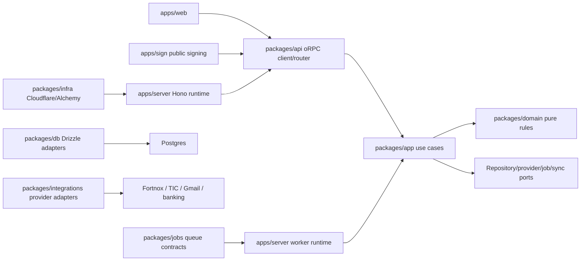

# Dawn Codebase Organization Handoff

This document is a portable briefing for a fresh architecture chat that has no
repo context. Paste this entire file into that chat before asking it to propose
an optimal codebase organization.

## Prompt For The Next Chat

You are helping reorganize the Dawn codebase before implementation continues.
Do not implement code yet. Produce a system-design proposal and migration plan
for the repository organization based only on the context below.

The product is now a Fortnox-native quote-to-cash CRM for Swedish B2B sales:
account/contact -> deal -> quote/contract -> TIC BankID signing/trust check ->
Fortnox invoice -> payment timeline. Fortnox is the first provider, but shared
architecture should stay accounting-provider-native so Spiris/eAccounting can be
proven later without rewriting the commercial core.

The desired output from you:

1. Propose pragmatic feature-file organization inside the existing packages.
2. Identify which broad files are painful enough to split now.
3. Define ownership rules for domain logic, application use cases,
   repositories, provider adapters, API routes, workers/jobs, sync, and UI.
4. Recommend feature-aligned filenames where useful.
5. Provide a phased migration plan that avoids big-bang moves.
6. Call out risks, dependency cycles, naming traps, and over-abstraction risks.
7. Keep product scope tight: do not make generic CRM metadata, public API,
   generic automation, banking ledger, accountant handoff, projects/time, AI
   copilot, or Spiris/Visma parity blockers for the first beta.

## Active Product Source Of Truth

- Active PRD: `docs/product/FORTNOX-SALES-OS-PRD.md`
- Active slices: `docs/work/FORTNOX-SALES-OS-VERTICAL-SLICES.md`
- Domain concepts: `CONTEXT.md`
- Code routing map: `CONTEXT-MAP.md`
- Architecture decisions: `docs/adr/`
- Feature-file organization: `docs/adr/0014-feature-file-organization.md`
- Repo guidance: `AGENTS.md`
- Read-only reference clone: `ref/midday` is intentionally ignored by git and
  should not be edited.

## Product Thesis

Dawn is not trying to become a generic CRM platform for the first beta. It is
trying to own the Swedish B2B commercial workflow around Fortnox:

- Dawn owns workflow, account/contact/deal context, quote/contract versions,
  signing state, trust decisions, evidence packages, handoff approvals, and the
  operational timeline.
- Fortnox owns accounting-side customers/articles/invoices/payment state for the
  first provider path.
- Provider-native means the core language should avoid hard-coding every concept
  to Fortnox, but the first complete product path should sell and behave as
  Fortnox-first.
- TIC is the identity/signing/trust provider boundary for BankID signing and
  company-role trust context.

## Non-Negotiable Architecture Rules

- Keep business rules out of route handlers, UI components, workers, and
  provider adapters.
- Shared business behavior belongs in `packages/domain` and `packages/app`.
- Public API, internal oRPC, webhooks, workers, automations, and AI tools should
  call application use cases instead of touching database queries directly.
- Postgres is authoritative. Durable Objects, TanStack DB, KV, cache, search,
  and vector indexes are projections or coordination layers.
- Prefer Cloudflare-native primitives: Workers, Durable Objects, Queues,
  Workflows, R2, KV, Hyperdrive.
- Trigger.dev is allowed only behind job contracts where Cloudflare limits or
  workflow visibility justify it.
- Money must use exact integer/minor-unit representations, never floating point.
- Provider adapters must stay behind ports.
- AI tools must call application use cases.
- Public API must be versioned, scoped, idempotency-aware, and use-case-backed.

## Baseline ADRs

- `0001`: application layer owns business mutations.
- `0002`: Postgres is the authoritative store.
- `0003`: Cloudflare-first runtime boundaries.
- `0004`: Durable Objects coordinate tenants.
- `0005`: outbox is the event backbone.
- `0006`: money uses exact representations.
- `0007`: TanStack DB sync is a server-authorized projection.
- `0008`: TanStack AI tools call application use cases.
- `0009`: provider adapters are isolated behind ports.
- `0010`: Trigger.dev is an exception behind job contracts.
- `0011`: public API is versioned, scoped, and use-case-backed.
- `0012`: auth and registry providers are boundary layers.
- `0013`: product scope is Fortnox-native quote-to-cash.
- `0014`: Dawn stays a feature-aligned modular monolith. Keep current packages,
  allow pragmatic type/schema imports, and enforce business mutations through
  app/domain.

## Current Stack

- Package manager/runtime: Bun `1.3.9`.
- Monorepo workspaces: `apps/*`, `packages/*`.
- Web app: React, Vite, TanStack Router, TanStack Query, shared UI.
- Public signing app: React/Vite separate `apps/sign` surface.
- Server: Hono, oRPC, OpenAPI, Better Auth session extraction.
- Desktop: Electrobun shell around the web app.
- Database: Drizzle/Postgres schema and repository adapters.
- Infra: Cloudflare/Alchemy for Workers, Queues, R2, KV, Durable Objects,
  optional Hyperdrive.
- UI policy: new product UI should prefer coss UI primitives/particles.

## Root Commands

- Install: `bun install`
- Run all dev tasks: `bun run dev`
- Web only: `bun run dev:web`
- Public signing app: `bun run dev:sign`
- Server only: `bun run dev:server`
- Desktop only: `bun run dev:desktop`
- Typecheck: `bun run check-types`
- Lint/format check: `bun run check`
- Tests: `bun run test`
- Unit tests: `bun run test:unit`
- PGlite tests: `bun run test:pglite`
- Postgres tests: `bun run test:postgres`
- Vitest/browser-ish tests: `bun run test:vitest`
- E2E tests: `bun run test:e2e`
- Release gate: `bun run release:gate`
- Database push: `bun run db:push`
- Database migrations: `bun run db:migrate`
- Cloudflare deploy: `bun run deploy`

## Current Package Responsibilities

### `apps/web`

React/Vite/TanStack Router main authenticated app. Navigation is now focused on
Home, Deals, Customers, Documents, Invoices, and Settings. Many active product
pages are still planned surfaces/placeholders. Older business-OS pages such as
transactions, inbox, projects, reports, operations, and tracker remain present
and are treated as parked surfaces.

### `apps/sign`

Public recipient signing app. It reads a recipient token from path/query/hash,
calls public oRPC endpoints without credentials, renders the signing package,
starts TIC signing, polls status, and downloads receipt/evidence.

### `apps/server`

Hono runtime edge app. Owns HTTP composition, Better Auth routes, CORS,
document upload/download endpoints, sync subscription endpoints, internal
outbox/sync endpoints, public REST API, provider webhooks, OpenAPI document, and
oRPC handler. Also exports the Durable Object tenant coordinator and worker
queue runtime.

### `apps/desktop`

Electrobun shell around the app. Handles tray, deep links, app-window lifecycle,
and local file capture.

### `packages/domain`

Pure domain rules and types. Includes identity/permissions, money,
CRM/account/contact/opportunity concepts, commercial documents, signature
evidence, trust checks, invoice handoff rules, Fortnox normalization, and older
business-OS domains.

### `packages/app`

Application use cases. Owns authorization-aware command/query behavior,
repository port types, idempotency/outbox dispatch patterns, commercial document
workflow, signing, trust, invoice handoff, CRM, Fortnox OAuth/catalog use cases,
market/prospect bridge, and older parked modules.

### `packages/api`

oRPC/router/transport layer. Defines context, protected/public procedures,
router input schemas, route groups, test context, document URL helpers, and some
default dependency wiring. Current design concern is not the existence of DB
imports by itself; DB schema/types are fine in API code. The concern is route
handlers owning business data access or broad router files collecting unrelated
feature behavior.

### `packages/db`

Drizzle schema, migrations, test database utilities, and the large
`DrizzleDawnRepository`. Current design concern is file size and feature mixing.
DB repositories may import narrow app repository types, but should not import app
use-case behavior.

### `packages/integrations`

Provider boundaries and adapters. Includes banking provider mocks/sandbox,
Gmail/email inbox connector surface, Fortnox OAuth/sync/catalog/token/health,
mock Fortnox invoice creation, TIC signature provider, TIC company-role provider,
and invoice email delivery.

### `packages/jobs`

Queue message contracts and outbox-event-to-job mapping. Includes job schemas for
outbox dispatch, sync invalidation, document extraction, matching, imports,
provider sync, recurring invoices, insights, automations, banking, Fortnox sync,
Fortnox invoice creation, webhook delivery, team export/delete, and accountant
packet export.

### `packages/sync`

TanStack DB sync collection contracts and tests. Currently covers transactions
and projects only; it is a server-authorized projection layer, not authoritative
business state.

### `packages/auth`

Better Auth setup, Drizzle auth adapter wiring, Google OAuth token access, and
Polar payments integration.

### `packages/env`

Typed environment parsing for server/web and Google OAuth helpers. Current
design concern: package metadata says it depends on `@dawn/infra`, which may be
an inversion smell if env should be below infra.

### `packages/infra`

Cloudflare binding types and Alchemy deployment resources. Creates R2/KV/Queues,
Durable Object namespace, optional Hyperdrive, API worker, worker, and Vite web
deployment.

### `packages/ui`

Shared UI primitives and global styles. Existing primitives are coss-ish/base
components. App-specific compositions live under `apps/web/src/components`.

### `packages/ai`

Assistant/tool registry, deterministic mock model, CSV mapping prompt, weekly
insight provider, and evals.

### `packages/documents`

Document extraction pipeline and evals. Uses model-provider cascade for document
field extraction and belongs mostly to older inbox/OCR infrastructure.

### `packages/config`

Shared TypeScript base config package.

## Current Package Dependency Graph

Declared workspace dependencies from package manifests:

```text
desktop                apps/desktop             -> (none)
server                 apps/server              -> @dawn/ai, @dawn/api, @dawn/app, @dawn/auth, @dawn/config, @dawn/db, @dawn/documents, @dawn/domain, @dawn/env, @dawn/infra, @dawn/integrations, @dawn/jobs, @dawn/sync
sign                   apps/sign                -> @dawn/api, @dawn/config, @dawn/domain, @dawn/env, @dawn/ui
web                    apps/web                 -> @dawn/api, @dawn/config, @dawn/domain, @dawn/env, @dawn/sync, @dawn/ui
@dawn/ai               packages/ai              -> @dawn/config, @dawn/domain
@dawn/api              packages/api             -> @dawn/ai, @dawn/app, @dawn/auth, @dawn/config, @dawn/db, @dawn/domain, @dawn/env, @dawn/integrations
@dawn/app              packages/app             -> @dawn/ai, @dawn/config, @dawn/domain, @dawn/integrations, @dawn/jobs, @dawn/sync
@dawn/auth             packages/auth            -> @dawn/config, @dawn/db, @dawn/env
@dawn/config           packages/config          -> (none)
@dawn/db               packages/db              -> @dawn/app, @dawn/config, @dawn/domain, @dawn/env
@dawn/documents        packages/documents       -> @dawn/config
@dawn/domain           packages/domain          -> @dawn/config
@dawn/env              packages/env             -> @dawn/config, @dawn/infra
@dawn/infra            packages/infra           -> @dawn/config, @dawn/jobs
@dawn/integrations     packages/integrations    -> @dawn/config, @dawn/domain, @dawn/env
@dawn/jobs             packages/jobs            -> @dawn/config
@dawn/sync             packages/sync            -> @dawn/config, @dawn/domain
@dawn/ui               packages/ui              -> @dawn/config
```

Practical design pressure from this graph:

- `packages/db -> packages/app` is acceptable when it imports narrow repository
  types, preferably type-only. It should not import app use-case behavior.
- `packages/api -> packages/db` is acceptable for schema/types, DTO helpers,
  test factories, admin/debug serialization, and similar support code. It should
  not put business mutations in route handlers.
- `packages/app -> packages/integrations/jobs/sync` is acceptable when using
  provider/job/sync contracts or test adapters. Keep concrete provider behavior
  in integrations and runtime wiring.
- `apps/server` importing many packages is expected because it is a runtime edge.

Observed source import edges from current TypeScript files, counted by import
statements:

```text
  1 apps/server -> packages/ai
  3 apps/server -> packages/api
 15 apps/server -> packages/app
  1 apps/server -> packages/auth
  2 apps/server -> packages/db
  1 apps/server -> packages/documents
  1 apps/server -> packages/domain
  5 apps/server -> packages/env
  8 apps/server -> packages/infra
  2 apps/server -> packages/integrations
 12 apps/server -> packages/jobs
  6 apps/server -> packages/sync
  2 apps/sign -> packages/api
  1 apps/sign -> packages/domain
  1 apps/sign -> packages/env
  5 apps/sign -> packages/ui
  1 apps/web -> packages/api
  6 apps/web -> packages/domain
  6 apps/web -> packages/env
  5 apps/web -> packages/sync
 47 apps/web -> packages/ui
  3 packages/ai -> packages/domain
  1 packages/api -> packages/ai
 15 packages/api -> packages/app
  3 packages/api -> packages/auth
  1 packages/api -> packages/db
  3 packages/api -> packages/domain
  5 packages/api -> packages/env
  4 packages/api -> packages/integrations
  4 packages/app -> packages/ai
 59 packages/app -> packages/domain
 18 packages/app -> packages/integrations
  3 packages/app -> packages/jobs
  3 packages/app -> packages/sync
  2 packages/auth -> packages/db
  5 packages/auth -> packages/env
  3 packages/db -> packages/app
  4 packages/db -> packages/domain
  1 packages/db -> packages/env
  2 packages/infra -> packages/jobs
  3 packages/integrations -> packages/domain
  1 packages/integrations -> packages/env
  1 packages/sync -> packages/domain
```

## Runtime Flow Overview



Pragmatic dependency direction:

```text
apps/* runtime/UI
  -> packages/api routers
  -> packages/app use cases
  -> packages/domain pure rules

packages/api may import DB schema/types, but business state changes call app.
packages/db may implement narrow app repository types, but not app use cases.
packages/integrations owns provider adapters.
workers call app use cases.
```

## Server Surface

`apps/server/src/index.ts` currently includes:

- Better Auth routes: `/api/auth/*`
- CORS, request IDs, evlog logging.
- Signed document upload/download:
  - `PUT /documents/upload/:token`
  - `GET /documents/download/:token`
- TanStack DB sync subscriptions:
  - `/sync/transactions/subscribe`
  - `/sync/projects/subscribe`
- Internal jobs/sync:
  - `/internal/outbox/dispatch`
  - `/internal/sync/invalidate`
- Public REST API and OpenAPI:
  - `/api/v1/openapi.json`
  - older REST operations for transactions, bank accounts, invoices, documents,
    inbox items, customers, products, projects, reports, webhook subscriptions.
- Provider webhooks:
  - sandbox banking webhook
  - TIC signing webhook
- oRPC catch-all handler.
- Durable Object export: `TenantCoordinator`.

`apps/server/src/worker-runtime.ts` registers queue handlers for:

- `outbox.dispatch`
- `sync.invalidate`
- `document.extract`
- `transaction.match_pending_inbox`
- `inbox.match_bidirectional_batch`
- `transaction_import.commit`
- `inbox.match_suggestions`
- `inbox.provider.sync`
- `invoice.recurring.generate`
- `insights.weekly.generate`
- `automation.run`
- `bank.sync`
- `fortnox.sync`
- `fortnox.create_invoice`
- `webhook.deliver`
- `team_data.export`
- `accountant_packet.export`
- `team_data.delete`

The Fortnox invoice worker path currently uses a mock Fortnox invoice provider.

## API Router Surface

`packages/api/src/routers/index.ts` now composes feature router files and
exposes these major router groups:

- `teams`
- `transactionReview`
- `sync`
- `ledger`
- `reports`
- `assistant`
- `automations`
- `developers`
- `operations`
- `banking`
- `integrations`
- `emailInbox`
- `billing`
- `market`
- `crm`
- `commercialDocuments`
- `trust`
- `invoiceHandoff`
- `projects`
- `documents`
- `inbox`
- `csvImport`

Important quote-to-cash routes:

- CRM:
  - create object type definition
  - create field definition
  - set record field value
  - create/update/archive organization/account/contact/opportunity
  - create legal entity
  - update opportunity stage
  - link account to Fortnox/provider customer
  - suggest account duplicates
  - account summary
  - account timeline
  - list accounts
- Commercial documents:
  - create
  - update draft
  - preview PDF
  - finalize
  - get PDF
  - revise
  - send
  - start TIC signature
  - signature evidence
  - TIC webhook
  - recipient view/decline/status/start/receipt
- Trust:
  - read/update policy
  - request trust check
  - get trust check for signature
  - review trust check
- Invoice handoff:
  - read/update policy
  - get handoff for document
  - request handoff
  - approve
  - retry

## Domain Model Snapshot

Active quote-to-cash domain modules:

- `identity.ts`: actor, team roles, permission model, request source concepts.
- `money.ts`: exact minor-unit money parsing/formatting/arithmetic.
- `crm.ts`: organization, legal entity, account, contact, opportunity, record
  envelope, stage model, CRM metadata.
- `crm-permissions.ts`: record grants and field-level CRM security.
- `fortnox.ts`: Fortnox/provider external ID and organization-number helpers.
- `market.ts`: market-origin company snapshot and prospect bridge.
- `commercial-documents.ts`: quote/contract draft, line totals, immutable
  version snapshots, status transitions.
- `signatures.ts`: TIC signing request/evidence, hidden signed data, signing
  text, hashes, receipt/evidence verification.
- `trust.ts`: trust policy, signer/company trust check statuses, review gates.
- `invoice-handoff.ts`: invoice handoff policy/status/provider payload/gates.

Older/parked modules still present:

- banking ledger, transactions, matching, CSV import, documents/inbox,
  projects/time, automations, assistant, reports, developer/public API,
  billing/invoices.

## Database Model Snapshot

`packages/db/src/schema/auth.ts`:

- Better Auth tables.

`packages/db/src/schema/core.ts`:

- team, membership, team invite
- ledger/bank/transactions/import/accounting/accountant lifecycle
- audit/outbox/job/provider object
- integration connection
- document/inbox/document extraction
- billing/invoice/project
- assistant/automation
- API key/OAuth app/webhook/idempotency

`packages/db/src/schema/crm.ts`:

- CRM record, CRM metadata, grants, field security
- party/organization/person/legal entity/account/contact/opportunity
- market company/snapshot/prospect
- commercial document/document lines/document versions
- signature request/signature party/signature evidence
- trust policy/trust check
- invoice handoff policy/invoice handoff

`packages/db/src/dawn-repository.ts` is the large Drizzle adapter implementing
the application repository ports. It is a strong candidate for modular split.

## Current Implementation Status

Based on current docs and files:

- Slice 0, product cut/source-of-truth: completed.
- Slice 1, Fortnox foundation: in progress.
- Slice 2, minimal sales CRM: in progress, substantial foundations landed.
- Slice 3, commercial document/quote builder: in progress, substantial
  foundations landed.
- Slice 3.5, market-origin and TIC company snapshot bridge: marked completed in
  current slice doc.
- Slice 4, TIC BankID signing evidence package: marked completed in current
  slice doc.
- Slice 4.5, recipient signing surface: app/files exist and route is ready
  alongside slice 4.
- Slice 5, TIC company context and signer trust: in progress.
- Slice 6, Fortnox invoice handoff: in progress.
- Slice 7, pilot product surface and operations: ready.
- Slices 8-19 are north-star AI/market-to-revenue expansion and should not block
  the first beta.
- Slice 20 Spiris/Visma provider-2 spike is parked until the Fortnox path has
  pilot signal.

There is a minor doc-status inconsistency: an earlier line in the slice plan says
the current checkpoint is through slice 3 and build 3.5 next, but later statuses
and current files show 3.5/4 are already represented and 5/6 are in progress.
Treat code plus latest slice statuses as the better signal.

## Known Architecture Pressure Points

1. `packages/app/src/index.ts` is a broad shared entrypoint and exports a very
   large `DawnRepository` intersection. This may become harder to reason about
   as quote-to-cash expands.
2. `packages/db/src/dawn-repository.ts` is a large multi-domain adapter. Split
   new or touched repository behavior into feature files and let the aggregate
   repository delegate.
3. Repository port types may live with app features. DB can import narrow types,
   but not app use-case functions.
4. `packages/api/src/routers/index.ts` is now a composition file. Keep route
   schemas and handlers in feature router files, and do not pursue pure
   transport as a goal by itself.
5. `packages/app` depends on integrations/jobs/sync. This is okay only if it
   depends on contracts/ports, not concrete provider runtime behavior.
6. Product naming still mixes broad business OS and quote-to-cash CRM. Do not do
   a cosmetic global rename before the product path is stable, but define naming
   rules for new modules.
7. The UI nav is active-product-focused, but many pages are placeholders.
   Architecture should not require building parked pages to proceed.
8. Public API, automations, AI tools, accountant flows, banking ledger, and
   projects are useful infrastructure but are not first-beta product blockers.
9. `packages/env -> packages/infra` in package metadata should be reviewed as a
   possible dependency inversion.
10. The future provider-2 proof should shape boundaries, but not force generic
    abstractions before Fortnox quote-to-cash is real.

## Suggested Target Design Questions

Ask the next chat to answer these directly:

- Which broad file is currently painful enough to split?
- What feature filename should be used consistently across domain/app/api/db?
- Does any route handler own a business mutation that should move to app?
- Does any DB helper import app behavior instead of narrow types?
- Is new code being added to one of the known broad files unnecessarily?
- How can Dawn, Sign, and future Solo share backend capabilities without
  splitting backend packages?

## Testing And Quality

- `docs/TESTING.md` defines the layer-owned testing strategy.
- `scripts/run-tests.ts` owns test lanes: unit, pglite, postgres, vitest, e2e.
- CI runs `bun install --frozen-lockfile` and `bun run release:gate`.
- Release gate checks ignored TypeScript, secrets, migrations, types, tests,
  AI/document evals, formatting/linting, and server worker build.
- There are domain tests for pure rules, app tests for use cases, PGlite/Postgres
  tests for repository behavior, router/server tests, and happy-dom tests for
  web/sign/ui surfaces.

## Full File Inventory

Generated from `git ls-files --cached --others --exclude-standard`, sorted. This
includes tracked files and current untracked implementation files, while
excluding ignored generated/build artifacts such as `node_modules`, `dist`,
`.alchemy`, and `ref/midday`.

```text
.agents/skills/coss/SKILL.md
.agents/skills/coss/references/cli.md
.agents/skills/coss/references/component-registry.md
.agents/skills/coss/references/portal-props.md
.agents/skills/coss/references/primitives/accordion.md
.agents/skills/coss/references/primitives/alert-dialog.md
.agents/skills/coss/references/primitives/alert.md
.agents/skills/coss/references/primitives/autocomplete.md
.agents/skills/coss/references/primitives/avatar.md
.agents/skills/coss/references/primitives/badge.md
.agents/skills/coss/references/primitives/breadcrumb.md
.agents/skills/coss/references/primitives/button.md
.agents/skills/coss/references/primitives/calendar.md
.agents/skills/coss/references/primitives/card.md
.agents/skills/coss/references/primitives/checkbox-group.md
.agents/skills/coss/references/primitives/checkbox.md
.agents/skills/coss/references/primitives/collapsible.md
.agents/skills/coss/references/primitives/combobox.md
.agents/skills/coss/references/primitives/command.md
.agents/skills/coss/references/primitives/context-menu.md
.agents/skills/coss/references/primitives/dialog.md
.agents/skills/coss/references/primitives/drawer.md
.agents/skills/coss/references/primitives/empty.md
.agents/skills/coss/references/primitives/field.md
.agents/skills/coss/references/primitives/fieldset.md
.agents/skills/coss/references/primitives/form.md
.agents/skills/coss/references/primitives/frame.md
.agents/skills/coss/references/primitives/group.md
.agents/skills/coss/references/primitives/input-group.md
.agents/skills/coss/references/primitives/input.md
.agents/skills/coss/references/primitives/kbd.md
.agents/skills/coss/references/primitives/label.md
.agents/skills/coss/references/primitives/menu.md
.agents/skills/coss/references/primitives/meter.md
.agents/skills/coss/references/primitives/number-field.md
.agents/skills/coss/references/primitives/otp-field.md
.agents/skills/coss/references/primitives/pagination.md
.agents/skills/coss/references/primitives/popover.md
.agents/skills/coss/references/primitives/preview-card.md
.agents/skills/coss/references/primitives/progress.md
.agents/skills/coss/references/primitives/radio-group.md
.agents/skills/coss/references/primitives/scroll-area.md
.agents/skills/coss/references/primitives/select.md
.agents/skills/coss/references/primitives/separator.md
.agents/skills/coss/references/primitives/sheet.md
.agents/skills/coss/references/primitives/sidebar.md
.agents/skills/coss/references/primitives/skeleton.md
.agents/skills/coss/references/primitives/slider.md
.agents/skills/coss/references/primitives/spinner.md
.agents/skills/coss/references/primitives/switch.md
.agents/skills/coss/references/primitives/table.md
.agents/skills/coss/references/primitives/tabs.md
.agents/skills/coss/references/primitives/textarea.md
.agents/skills/coss/references/primitives/toast.md
.agents/skills/coss/references/primitives/toggle-group.md
.agents/skills/coss/references/primitives/toggle.md
.agents/skills/coss/references/primitives/toolbar.md
.agents/skills/coss/references/primitives/tooltip.md
.agents/skills/coss/references/rules/composition.md
.agents/skills/coss/references/rules/forms.md
.agents/skills/coss/references/rules/migration.md
.agents/skills/coss/references/rules/styling.md
.agents/skills/tanstack-router-best-practices/SKILL.md
.agents/skills/tanstack-router-best-practices/rules/ctx-root-context.md
.agents/skills/tanstack-router-best-practices/rules/err-not-found.md
.agents/skills/tanstack-router-best-practices/rules/load-ensure-query-data.md
.agents/skills/tanstack-router-best-practices/rules/load-parallel.md
.agents/skills/tanstack-router-best-practices/rules/load-use-loaders.md
.agents/skills/tanstack-router-best-practices/rules/nav-link-component.md
.agents/skills/tanstack-router-best-practices/rules/nav-route-masks.md
.agents/skills/tanstack-router-best-practices/rules/org-virtual-routes.md
.agents/skills/tanstack-router-best-practices/rules/preload-intent.md
.agents/skills/tanstack-router-best-practices/rules/router-default-options.md
.agents/skills/tanstack-router-best-practices/rules/search-custom-serializer.md
.agents/skills/tanstack-router-best-practices/rules/search-validation.md
.agents/skills/tanstack-router-best-practices/rules/split-lazy-routes.md
.agents/skills/tanstack-router-best-practices/rules/ts-register-router.md
.agents/skills/tanstack-router-best-practices/rules/ts-use-from-param.md
.github/workflows/ci.yml
.gitignore
.oxfmtrc.json
.oxlintrc.json
AGENTS.md
CONTEXT-MAP.md
CONTEXT.md
README.md
apps/desktop/.gitignore
apps/desktop/electrobun.config.ts
apps/desktop/package.json
apps/desktop/src/bun/index.ts
apps/desktop/src/bun/shell.test.ts
apps/desktop/src/bun/shell.ts
apps/desktop/tsconfig.json
apps/server/.gitignore
apps/server/package.json
apps/server/src/accountant-packet-export.test.ts
apps/server/src/accountant-packet-export.ts
apps/server/src/cloudflare.ts
apps/server/src/cors.test.ts
apps/server/src/cors.ts
apps/server/src/csv-transaction-import.test.ts
apps/server/src/csv-transaction-import.ts
apps/server/src/data-export.test.ts
apps/server/src/data-export.ts
apps/server/src/dev.ts
apps/server/src/document-extraction.test.ts
apps/server/src/document-extraction.ts
apps/server/src/document-storage.test.ts
apps/server/src/document-storage.ts
apps/server/src/e2e/public-api.e2e.test.ts
apps/server/src/index.ts
apps/server/src/observability.test.ts
apps/server/src/observability.ts
apps/server/src/outbox-queue.ts
apps/server/src/public-api.test.ts
apps/server/src/rate-limit.test.ts
apps/server/src/rate-limit.ts
apps/server/src/tenant-coordinator.test.ts
apps/server/src/tenant-coordinator.ts
apps/server/src/tenant-sync.ts
apps/server/src/worker-runtime.test.ts
apps/server/src/worker-runtime.ts
apps/server/src/worker.ts
apps/server/tsconfig.json
apps/server/tsdown.config.ts
apps/sign/index.html
apps/sign/package.json
apps/sign/src/index.css
apps/sign/src/main.tsx
apps/sign/src/public-orpc.ts
apps/sign/src/signing-surface.tsx
apps/sign/src/signing-surface.vitest.test.tsx
apps/sign/tsconfig.json
apps/sign/vite.config.ts
apps/web/.gitignore
apps/web/components.json
apps/web/index.html
apps/web/package.json
apps/web/src/components/app-shell.tsx
apps/web/src/components/header.tsx
apps/web/src/components/loader.tsx
apps/web/src/components/loader.vitest.test.tsx
apps/web/src/components/mode-toggle.tsx
apps/web/src/components/sign-in-form.tsx
apps/web/src/components/sign-up-form.tsx
apps/web/src/components/theme-provider.tsx
apps/web/src/components/user-menu.tsx
apps/web/src/index.css
apps/web/src/lib/auth-client.ts
apps/web/src/lib/google-inbox-auth.ts
apps/web/src/lib/google-inbox-auth.vitest.test.ts
apps/web/src/main.tsx
apps/web/src/oauth-authorize.test.ts
apps/web/src/routes/-team-routing.ts
apps/web/src/routes/__root.tsx
apps/web/src/routes/_auth/-parked-surface.ts
apps/web/src/routes/_auth/-parked-surface.vitest.test.ts
apps/web/src/routes/_auth/-planned-surface.tsx
apps/web/src/routes/_auth/customers.tsx
apps/web/src/routes/_auth/dashboard.tsx
apps/web/src/routes/_auth/deals.tsx
apps/web/src/routes/_auth/documents.tsx
apps/web/src/routes/_auth/inbox.tsx
apps/web/src/routes/_auth/invoices.tsx
apps/web/src/routes/_auth/oauth/-authorize-helpers.ts
apps/web/src/routes/_auth/oauth/authorize.tsx
apps/web/src/routes/_auth/operations.tsx
apps/web/src/routes/_auth/projects.tsx
apps/web/src/routes/_auth/reports.tsx
apps/web/src/routes/_auth/route.tsx
apps/web/src/routes/_auth/settings.tsx
apps/web/src/routes/_auth/tracker.tsx
apps/web/src/routes/_auth/transactions.tsx
apps/web/src/routes/index.tsx
apps/web/src/routes/login.tsx
apps/web/src/routes/success.tsx
apps/web/src/sync/projects.ts
apps/web/src/sync/transactions.ts
apps/web/src/utils/orpc.ts
apps/web/tsconfig.json
apps/web/vite.config.ts
bun.lock
bunfig.toml
docker-compose.test.yml
docs/TESTING.md
docs/adr/0001-application-layer-owns-business-mutations.md
docs/adr/0002-postgres-is-the-authoritative-store.md
docs/adr/0003-cloudflare-first-runtime-boundaries.md
docs/adr/0004-durable-objects-coordinate-tenants.md
docs/adr/0005-outbox-is-the-event-backbone.md
docs/adr/0006-money-uses-exact-representations.md
docs/adr/0007-tanstack-db-sync-is-a-server-authorized-projection.md
docs/adr/0008-tanstack-ai-tools-call-application-use-cases.md
docs/adr/0009-provider-adapters-are-isolated-behind-ports.md
docs/adr/0010-trigger-dev-is-an-exception-behind-job-contracts.md
docs/adr/0011-public-api-is-versioned-scoped-and-use-case-backed.md
docs/adr/0012-auth-and-registry-providers-are-boundary-layers.md
docs/adr/0013-product-scope-is-fortnox-native-quote-to-cash.md
docs/adr/0014-feature-file-organization.md
docs/adr/README.md
docs/deployment/CLOUDFLARE.md
docs/product/DAWN-AI-NATIVE-CRM-NORTH-STAR-PRD.md
docs/product/FORTNOX-SALES-OS-PRD.md
docs/work/CODEBASE-ORGANIZATION-HANDOFF.md
docs/work/FORTNOX-SALES-OS-VERTICAL-SLICES.md
package.json
packages/ai/package.json
packages/ai/src/evals.cli.ts
packages/ai/src/evals.test.ts
packages/ai/src/evals.ts
packages/ai/src/index.ts
packages/ai/src/insights.test.ts
packages/ai/tsconfig.json
packages/api/.gitignore
packages/api/package.json
packages/api/src/accountant-packet-router.test.ts
packages/api/src/context.test.ts
packages/api/src/context.ts
packages/api/src/document-url.test.ts
packages/api/src/document-url.ts
packages/api/src/email-inbox-connectors.test.ts
packages/api/src/email-inbox-connectors.ts
packages/api/src/index.ts
packages/api/src/rate-limit.test.ts
packages/api/src/rate-limit.ts
packages/api/src/router.test.ts
packages/api/src/routers/assistant.ts
packages/api/src/routers/automations.ts
packages/api/src/routers/banking.ts
packages/api/src/routers/billing.ts
packages/api/src/routers/commercial-documents.ts
packages/api/src/routers/crm.ts
packages/api/src/routers/csv-import.ts
packages/api/src/routers/developers.ts
packages/api/src/routers/documents.ts
packages/api/src/routers/email-inbox.ts
packages/api/src/routers/inbox.ts
packages/api/src/routers/integrations.ts
packages/api/src/routers/invoice-handoff.ts
packages/api/src/routers/index.ts
packages/api/src/routers/ledger.ts
packages/api/src/routers/market.ts
packages/api/src/routers/operations.ts
packages/api/src/routers/projects.ts
packages/api/src/routers/reports.ts
packages/api/src/routers/sync.ts
packages/api/src/routers/teams.ts
packages/api/src/routers/transaction-review.ts
packages/api/src/routers/trust.ts
packages/api/src/testkit/context.ts
packages/api/tsconfig.json
packages/app/package.json
packages/app/src/accountant-close-flow.test.ts
packages/app/src/accountant-packet.test.ts
packages/app/src/accountant-packet.ts
packages/app/src/assistant.test.ts
packages/app/src/assistant.ts
packages/app/src/automation.ts
packages/app/src/automations.test.ts
packages/app/src/banking-ledger.ts
packages/app/src/banking.test.ts
packages/app/src/billing.test.ts
packages/app/src/billing.ts
packages/app/src/commercial-documents.test.ts
packages/app/src/commercial-documents.ts
packages/app/src/crm.test.ts
packages/app/src/crm.ts
packages/app/src/developer.ts
packages/app/src/developers.test.ts
packages/app/src/documents-inbox.ts
packages/app/src/documents.test.ts
packages/app/src/email-inbox.test.ts
packages/app/src/email-inbox.ts
packages/app/src/fortnox.ts
packages/app/src/inbox-extraction.test.ts
packages/app/src/inbox-matching.test.ts
packages/app/src/index.ts
packages/app/src/integrations.test.ts
packages/app/src/integrations.ts
packages/app/src/invoice-handoff.ts
packages/app/src/ledger.test.ts
packages/app/src/market.test.ts
packages/app/src/market.ts
packages/app/src/operations.test.ts
packages/app/src/operations.ts
packages/app/src/outbox-dispatch.test.ts
packages/app/src/projects-reporting.ts
packages/app/src/projects.test.ts
packages/app/src/rate-limit.test.ts
packages/app/src/rate-limit.ts
packages/app/src/reporting.test.ts
packages/app/src/request-context.test.ts
packages/app/src/signatures.test.ts
packages/app/src/signatures.ts
packages/app/src/team-permissions.test.ts
packages/app/src/testkit/fixtures.ts
packages/app/src/testkit/memory-repository.ts
packages/app/src/transaction-review.test.ts
packages/app/src/trust.ts
packages/app/src/webhook-signature.test.ts
packages/app/src/webhook-signature.ts
packages/app/tsconfig.json
packages/auth/.gitignore
packages/auth/package.json
packages/auth/src/google-provider.test.ts
packages/auth/src/google-tokens.test.ts
packages/auth/src/google-tokens.ts
packages/auth/src/index.ts
packages/auth/src/lib/payments.ts
packages/auth/tsconfig.json
packages/config/package.json
packages/config/tsconfig.base.json
packages/db/.gitignore
packages/db/drizzle.config.ts
packages/db/package.json
packages/db/src/dawn-repository.pglite.test.ts
packages/db/src/dawn-repository.postgres.test.ts
packages/db/src/dawn-repository.ts
packages/db/src/index.ts
packages/db/src/migrations/0000_nebulous_chronomancer.sql
packages/db/src/migrations/0001_powerful_talos.sql
packages/db/src/migrations/0002_dazzling_supreme_intelligence.sql
packages/db/src/migrations/0003_far_boom_boom.sql
packages/db/src/migrations/0004_majestic_amazoness.sql
packages/db/src/migrations/0005_swift_pride.sql
packages/db/src/migrations/0006_wise_firebrand.sql
packages/db/src/migrations/0007_burly_the_call.sql
packages/db/src/migrations/0008_blue_misty_knight.sql
packages/db/src/migrations/0009_jazzy_paladin.sql
packages/db/src/migrations/0010_odd_pyro.sql
packages/db/src/migrations/0011_secret_captain_flint.sql
packages/db/src/migrations/0012_careless_stick.sql
packages/db/src/migrations/0013_far_stick.sql
packages/db/src/migrations/0014_damp_clea.sql
packages/db/src/migrations/0015_dear_tarantula.sql
packages/db/src/migrations/0016_previous_killmonger.sql
packages/db/src/migrations/0017_demonic_fenris.sql
packages/db/src/migrations/0018_worried_ink.sql
packages/db/src/migrations/0019_yielding_talon.sql
packages/db/src/migrations/0020_orange_the_fallen.sql
packages/db/src/migrations/0021_free_ogun.sql
packages/db/src/migrations/0022_matching_suggestion_evidence.sql
packages/db/src/migrations/0023_transaction_accountant_lifecycle.sql
packages/db/src/migrations/0024_email_inbox_sync_lock.sql
packages/db/src/migrations/0025_accountant_packet_exports.sql
packages/db/src/migrations/0026_accountant_packet_revocation.sql
packages/db/src/migrations/0027_document_extraction_attempts.sql
packages/db/src/migrations/0028_crm_customer_graph_tracer.sql
packages/db/src/migrations/0029_crm_permissions_request_context.sql
packages/db/src/migrations/0030_crm_legal_entities_account_roles.sql
packages/db/src/migrations/0031_crm_metadata_extensions_tracer.sql
packages/db/src/migrations/0032_crm_opportunity_deal_stage.sql
packages/db/src/migrations/0033_crm_account_contacts.sql
packages/db/src/migrations/0034_commercial_documents_quote_builder.sql
packages/db/src/migrations/0035_market_origin_company_snapshot_bridge.sql
packages/db/src/migrations/0036_tic_signature_evidence.sql
packages/db/src/migrations/0037_tic_trust_checks.sql
packages/db/src/migrations/0038_invoice_handoffs.sql
packages/db/src/migrations/meta/0000_snapshot.json
packages/db/src/migrations/meta/0001_snapshot.json
packages/db/src/migrations/meta/0002_snapshot.json
packages/db/src/migrations/meta/0003_snapshot.json
packages/db/src/migrations/meta/0004_snapshot.json
packages/db/src/migrations/meta/0005_snapshot.json
packages/db/src/migrations/meta/0006_snapshot.json
packages/db/src/migrations/meta/0007_snapshot.json
packages/db/src/migrations/meta/0008_snapshot.json
packages/db/src/migrations/meta/0009_snapshot.json
packages/db/src/migrations/meta/0010_snapshot.json
packages/db/src/migrations/meta/0011_snapshot.json
packages/db/src/migrations/meta/0012_snapshot.json
packages/db/src/migrations/meta/0013_snapshot.json
packages/db/src/migrations/meta/0014_snapshot.json
packages/db/src/migrations/meta/0015_snapshot.json
packages/db/src/migrations/meta/0016_snapshot.json
packages/db/src/migrations/meta/0017_snapshot.json
packages/db/src/migrations/meta/0018_snapshot.json
packages/db/src/migrations/meta/0019_snapshot.json
packages/db/src/migrations/meta/0020_snapshot.json
packages/db/src/migrations/meta/0021_snapshot.json
packages/db/src/migrations/meta/_journal.json
packages/db/src/repositories/developer.ts
packages/db/src/repositories/integrations.ts
packages/db/src/repositories/types.ts
packages/db/src/schema/auth.ts
packages/db/src/schema/core.ts
packages/db/src/schema/crm.ts
packages/db/src/schema/index.ts
packages/db/src/testkit/pglite.ts
packages/db/src/testkit/postgres.ts
packages/db/tsconfig.json
packages/documents/package.json
packages/documents/src/evals.cli.ts
packages/documents/src/evals.test.ts
packages/documents/src/evals.ts
packages/documents/src/index.test.ts
packages/documents/src/index.ts
packages/documents/tsconfig.json
packages/domain/package.json
packages/domain/src/__fixtures__/golden-datasets.ts
packages/domain/src/__fixtures__/matching-evaluation.ts
packages/domain/src/assistant.ts
packages/domain/src/automations.ts
packages/domain/src/commercial-documents.test.ts
packages/domain/src/commercial-documents.ts
packages/domain/src/crm-metadata.test.ts
packages/domain/src/crm-permissions.test.ts
packages/domain/src/crm-permissions.ts
packages/domain/src/crm.ts
packages/domain/src/csv-import.test.ts
packages/domain/src/developer.ts
packages/domain/src/events.ts
packages/domain/src/fortnox.test.ts
packages/domain/src/fortnox.ts
packages/domain/src/golden-datasets.test.ts
packages/domain/src/identity.ts
packages/domain/src/inbox-matching.ts
packages/domain/src/index.ts
packages/domain/src/integrations.ts
packages/domain/src/invoice-handoff.ts
packages/domain/src/invoice.test.ts
packages/domain/src/invoices.ts
packages/domain/src/ledger.test.ts
packages/domain/src/market.test.ts
packages/domain/src/market.ts
packages/domain/src/matching-evaluation.cli.ts
packages/domain/src/matching-evaluation.test.ts
packages/domain/src/matching-evaluation.ts
packages/domain/src/matching.test.ts
packages/domain/src/money.test.ts
packages/domain/src/money.ts
packages/domain/src/permissions.test.ts
packages/domain/src/project-time.test.ts
packages/domain/src/projects.ts
packages/domain/src/reports.ts
packages/domain/src/shared.ts
packages/domain/src/signatures.test.ts
packages/domain/src/signatures.ts
packages/domain/src/transaction-categorization.ts
packages/domain/src/transaction-review.test.ts
packages/domain/src/transactions.ts
packages/domain/src/trust.test.ts
packages/domain/src/trust.ts
packages/domain/tsconfig.json
packages/env/package.json
packages/env/src/google-oauth.test.ts
packages/env/src/google-oauth.ts
packages/env/src/server.ts
packages/env/src/web.ts
packages/env/tsconfig.json
packages/infra/alchemy.run.ts
packages/infra/package.json
packages/infra/src/cloudflare.ts
packages/infra/src/environments.test.ts
packages/infra/src/environments.ts
packages/infra/tsconfig.json
packages/integrations/package.json
packages/integrations/src/__fixtures__/banking.ts
packages/integrations/src/__fixtures__/providers.ts
packages/integrations/src/banking.test.ts
packages/integrations/src/email-inbox.test.ts
packages/integrations/src/email-inbox.ts
packages/integrations/src/golden-fixtures.test.ts
packages/integrations/src/index.ts
packages/integrations/src/invoice-delivery.test.ts
packages/integrations/src/providers.test.ts
packages/integrations/tsconfig.json
packages/jobs/package.json
packages/jobs/src/index.test.ts
packages/jobs/src/index.ts
packages/jobs/tsconfig.json
packages/sync/package.json
packages/sync/src/index.ts
packages/sync/src/transactions.test.ts
packages/sync/tsconfig.json
packages/ui/components.json
packages/ui/package.json
packages/ui/postcss.config.mjs
packages/ui/src/components/badge.tsx
packages/ui/src/components/button.tsx
packages/ui/src/components/button.vitest.test.tsx
packages/ui/src/components/card.tsx
packages/ui/src/components/checkbox.tsx
packages/ui/src/components/dropdown-menu.tsx
packages/ui/src/components/input.tsx
packages/ui/src/components/label.tsx
packages/ui/src/components/menu.tsx
packages/ui/src/components/scroll-area.tsx
packages/ui/src/components/skeleton.tsx
packages/ui/src/components/spinner.tsx
packages/ui/src/components/table.tsx
packages/ui/src/components/toast.tsx
packages/ui/src/hooks/.gitkeep
packages/ui/src/lib/utils.ts
packages/ui/src/styles/globals.css
packages/ui/tsconfig.json
scripts/check-ignored-typescript.ts
scripts/check-migrations.ts
scripts/check-secrets.ts
scripts/run-tests.ts
skills-lock.json
tsconfig.json
vite.config.ts
vitest.config.ts
```

## Files To Inspect First If Repo Access Is Available

- `AGENTS.md`
- `CONTEXT.md`
- `CONTEXT-MAP.md`
- `docs/product/FORTNOX-SALES-OS-PRD.md`
- `docs/work/FORTNOX-SALES-OS-VERTICAL-SLICES.md`
- `docs/adr/0001-application-layer-owns-business-mutations.md`
- `docs/adr/0009-provider-adapters-are-isolated-behind-ports.md`
- `docs/adr/0013-product-scope-is-fortnox-native-quote-to-cash.md`
- `packages/domain/src/crm.ts`
- `packages/domain/src/commercial-documents.ts`
- `packages/domain/src/signatures.ts`
- `packages/domain/src/trust.ts`
- `packages/domain/src/invoice-handoff.ts`
- `packages/app/src/index.ts`
- `packages/app/src/crm.ts`
- `packages/app/src/commercial-documents.ts`
- `packages/app/src/signatures.ts`
- `packages/app/src/trust.ts`
- `packages/app/src/invoice-handoff.ts`
- `packages/db/src/schema/crm.ts`
- `packages/db/src/dawn-repository.ts`
- `packages/api/src/routers/index.ts`
- `packages/api/src/routers/assistant.ts`
- `packages/api/src/routers/automations.ts`
- `packages/api/src/routers/banking.ts`
- `packages/api/src/routers/billing.ts`
- `packages/api/src/routers/commercial-documents.ts`
- `packages/api/src/routers/crm.ts`
- `packages/api/src/routers/csv-import.ts`
- `packages/api/src/routers/developers.ts`
- `packages/api/src/routers/documents.ts`
- `packages/api/src/routers/email-inbox.ts`
- `packages/api/src/routers/inbox.ts`
- `packages/api/src/routers/integrations.ts`
- `packages/api/src/routers/ledger.ts`
- `packages/api/src/routers/trust.ts`
- `packages/api/src/routers/invoice-handoff.ts`
- `packages/api/src/routers/market.ts`
- `packages/api/src/routers/operations.ts`
- `packages/api/src/routers/projects.ts`
- `packages/api/src/routers/reports.ts`
- `packages/api/src/routers/sync.ts`
- `packages/api/src/routers/teams.ts`
- `packages/api/src/routers/transaction-review.ts`
- `apps/server/src/index.ts`
- `apps/server/src/worker-runtime.ts`
- `packages/jobs/src/index.ts`
- `packages/integrations/src/index.ts`
- `apps/sign/src/signing-surface.tsx`
- `apps/web/src/components/app-shell.tsx`
